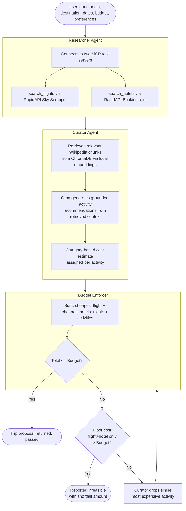

# WAYFARE

An AI-driven travel itinerary negotiator — a multi-agent system that researches real flights and hotels, curates real activity recommendations, and negotiates a full trip proposal down to a user's actual budget, rather than just estimating a price and hoping.

Built as a two-person collaborative project combining LangGraph orchestration, MCP tool-calling, and a RAG-based recommendation agent.

## The problem

Most trip-planning tools either give you a rough price estimate with no real inventory behind it, or dump a list of options and leave the budgeting to you. WAYFARE instead runs three cooperating agents that research real prices, recommend grounded activities, and — if the trip doesn't fit the budget — automatically revise the proposal (dropping discretionary costs first) until it either fits or is honestly reported as infeasible, with a clear explanation of the shortfall.

## Architecture



**Researcher agent** — Groq (`openai/gpt-oss-20b`) with tool-calling decides when to invoke two MCP servers: a flight search tool (RapidAPI's Sky Scrapper) and a hotel search tool (RapidAPI's Booking.com/DataCrawler). Both return real, live pricing.

**Curator agent** — a RAG pipeline: Wikipedia content for the destination is chunked and embedded locally (`BAAI/bge-small-en-v1.5`), indexed in ChromaDB, and retrieved per query. Groq then generates a grounded, personalized list of activity recommendations from that retrieved context (not from parametric memory), tagged with a category. Built by [Dhruv](https://github.com/dhruvHhh).

**Budget enforcer** — pure Python, no LLM. Computes the total cost against the budget. Flight and hotel are always fixed at their cheapest options (retrying with pricier ones can never help recover a failed check). If over budget, it drops the single most expensive activity and loops back to the curator — repeating until the trip passes or the "floor cost" (flight + hotel alone, zero activities) itself exceeds budget, at which point it reports the shortfall honestly rather than looping forever.

## Tech stack

* **Orchestration:** LangGraph (`StateGraph`, conditional edges for the negotiation retry loop)
* **LLM:** Groq (`openai/gpt-oss-20b`) — migrated from Gemini partway through the project for a ~13x faster raw response time and a far more generous free-tier quota
* **Tool integration:** Model Context Protocol (MCP) via `langchain-mcp-adapters`, two dedicated MCP servers for flights and hotels
* **Retrieval:** ChromaDB (persistent, local) + `sentence-transformers` (`BAAI/bge-small-en-v1.5`, local embeddings — no external embedding API dependency)
* **External data:** RapidAPI (Sky Scrapper for flights, Booking.com/DataCrawler for hotels), Wikipedia (curator's knowledge source)

## Setup

See `backend/TEAMMATE_SETUP.md` for full setup instructions, required API keys, and how to run the smoke test.

Quick version:

```bash
cd backend
python -m venv venv
venv\Scripts\activate        # Windows
pip install -r requirements.txt
cp .env.example .env         # then fill in your own GROQ_API_KEY and RAPIDAPI_KEY
python test_graph.py
```

## Known limitations

This project prioritizes real data wherever a genuinely free, individually-accessible API existed, and documents honestly where it doesn't:

* **Activity pricing is category-based, not live.** Real per-attraction ticket price APIs either don't expose clean entry fees (RapidAPI's Tripadvisor integration only surfaces bundled multi-stop tour prices, not simple admission costs) or don't have a workable free tier. Activities are instead priced by category (Religious Site/Park/Nature → ₹0, Museum → ₹300, Local Experience → ₹800, etc.), validated against real pricing data gathered during development rather than picked arbitrarily.
* **Flight and hotel prices are real and live,** sourced from RapidAPI on every run — no mock or cached data in the final pipeline.
* **The RAG corpus build is Wikipedia-dependent.** First call for a new destination takes ~60-90 seconds (builds and indexes the corpus); cached afterward (~20-30s).
* **Gemini was the original LLM choice,** replaced with Groq mid-project after hitting Gemini's free-tier daily quota repeatedly during testing — a real engineering tradeoff decision, not a cosmetic swap.

## Status

**Done:** LangGraph orchestration, real MCP tool-calling for flights/hotels, RAG-grounded curator, budget-enforcer negotiation loop with infeasibility detection, category-based activity pricing, full Gemini → Groq migration, real end-to-end testing.

**In progress / planned:** FastAPI backend wrapping the agent, frontend UI, containerized deployment.

## Credits

* Researcher, budget-enforcer, and LangGraph orchestration: [Pranav Moharir](https://github.com/PranavMoharir)
* RAG/curator agent: [Dhruv](https://github.com/dhruvHhh)
